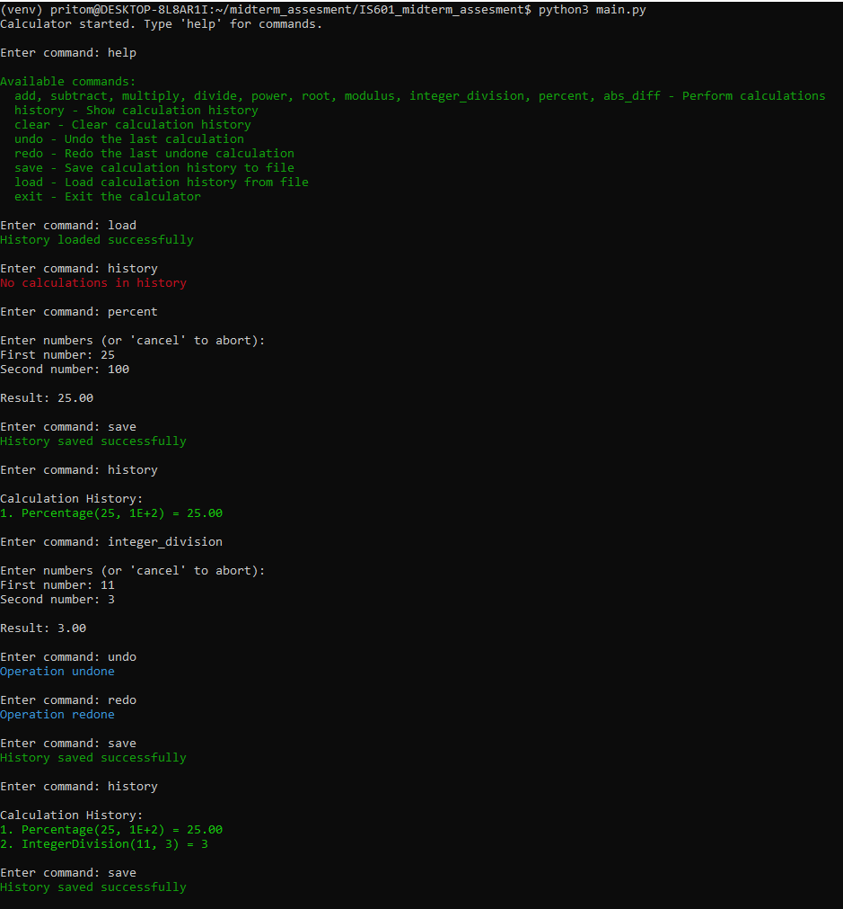

### Project overview:

### This is an advanced calculator application with various arithmetic operations,a command-line interface (REPL), and robust error handling.  
### This calculator supports the following commands  
```bash
		Available commands:
  		add, subtract, multiply, divide, power, root, modulus, integer_division, percent, abs_diff - Perform calculations
  		history - Show calculation history
  		clear - Clear calculation history
  		undo - Undo the last calculation
  		redo - Redo the last undone calculation
  		save - Save calculation history to file
  		load - Load calculation history from file
  		exit - Exit the calculator
```
Setup
Clone the repository
```bash
git@github.com:pritomssaha/IS601_midterm_assesment.git
```
change the directory to the project 
```bash
cd IS601_midterm_assesment
```
Create python virtual environment and activate it
```bash
python -m venv venv
source venv/bin/activate
```
Install from requirements.txt
```bash
pip install -r requirements.txt
```
Run pytest and verify
```bash
---------- coverage: platform linux, python 3.12.3-final-0 -----------
Name                        Stmts   Miss  Cover   Missing
---------------------------------------------------------
app/__init__.py                 0      0   100%
app/calculation.py             50      4    92%   85, 156, 168, 190
app/calculator.py             133     12    91%   219, 230-233, 272-275, 309-312, 344, 371
app/calculator_config.py       42      0   100%
app/calculator_memento.py      13      2    85%   34, 53
app/calculator_repl.py        109     20    82%   91, 121-122, 125-126, 142, 149-168
app/exception.py                2      0   100%
app/exceptions.py               8      0   100%
app/history.py                 23      0   100%
app/input_validators.py        18      0   100%
app/operation_command.py       49     11    78%   9, 46-48, 53-55, 59-61, 66
app/operations.py              92      0   100%
---------------------------------------------------------
TOTAL                         539     49    91%
Coverage HTML written to dir htmlcov
```
Run the calculator
```bash
python3 main.py
```

After running the application, the calculations are stored in calculator_history.csv file

```bash
(venv) pritom@DESKTOP-8L8AR1I:~/midterm_assesment/IS601_midterm_assesment$ cat ./history/calculator_history.csv
operation,operand1,operand2,result,timestamp
Percentage,25,1E+2,25.00,2026-03-09T18:10:30.217763
IntegerDivision,11,3,3,2026-03-09T18:10:48.782246
```
Also, the application writes log to a log file 

```bash
2026-03-09 18:10:15,029 - INFO - Logging initialized at: /home/pritom/midterm_assesment/IS601_midterm_assesment/logs/calculator.log
2026-03-09 18:10:15,029 - INFO - No history file found - starting with empty history
2026-03-09 18:10:15,029 - INFO - Calculator initialized with configuration
2026-03-09 18:10:15,030 - INFO - Added observer: LoggingObserver
2026-03-09 18:10:15,030 - INFO - Added observer: AutoSaveObserver
2026-03-09 18:10:22,511 - INFO - No history file found - starting with empty history
2026-03-09 18:10:30,217 - INFO - Set operation: Percentage
2026-03-09 18:10:30,217 - INFO - Calculation performed: Percentage (25, 1E+2) = 25.00
2026-03-09 18:10:32,083 - INFO - History saved successfully to /home/pritom/midterm_assesment/IS601_midterm_assesment/history/calculator_history.csv
2026-03-09 18:10:48,782 - INFO - Set operation: IntegerDivision
2026-03-09 18:10:48,782 - INFO - Calculation performed: IntegerDivision (11, 3) = 3
2026-03-09 18:10:54,357 - INFO - History saved successfully to /home/pritom/midterm_assesment/IS601_midterm_assesment/history/calculator_history.csv
2026-03-09 18:11:06,228 - INFO - History saved successfully to /home/pritom/midterm_assesment/IS601_midterm_assesment/history/calculator_history.csv
```
